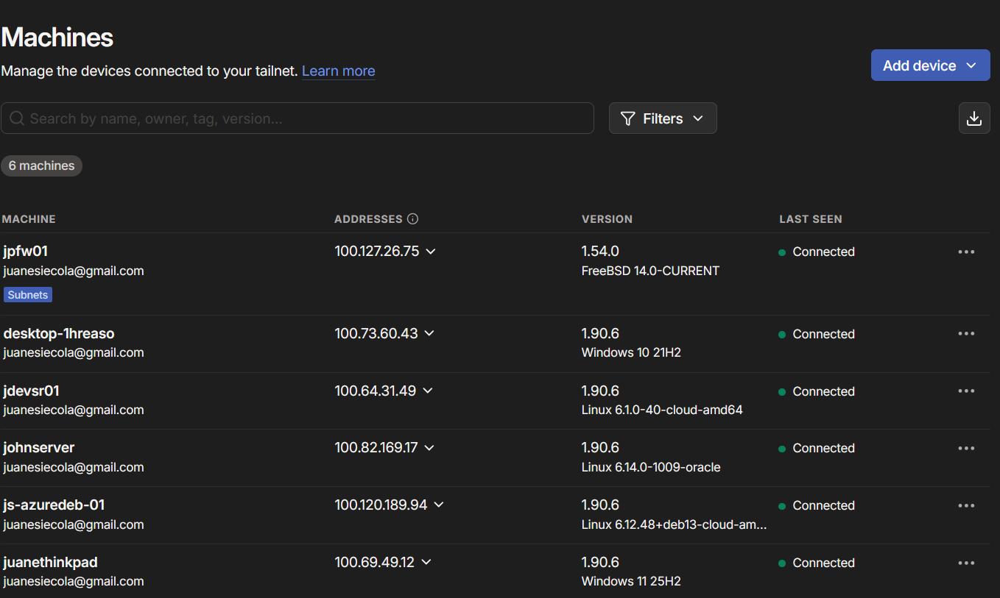

# ☁️ Cloud Ingress (AWS Reverse Proxy con NPM)
> **Punto de Entrada Público:** `https://netbox.js-lab-uy.duckdns.org`, `https://kuma.js-lab-uy.duckdns.org`, `https://homer.js-lab-uy.duckdns.org`

Este componente centraliza el punto de entrada público a todos los servicios internos del laboratorio. Utiliza una Máquina Virtual (VM) en AWS y Nginx Proxy Manager (NPM) para una gestión gráfica y eficiente del tráfico, SSL y Reverse Proxy.

## 1. Diseño de la Arquitectura

El diseño aprovecha la gestión centralizada de NPM y mantiene la seguridad del túnel VPN mediante **Tailscale**.

| Componente        | Función |
|-------------------|---------|
| **AWS EC2 VM**    | Host del Proxy Reverso (pequeña y económica). |
| **Docker / Docker Compose** | Entorno de ejecución de NPM. |
| **Nginx Proxy Manager (NPM)** | Gestión gráfica de SSL (Let's Encrypt) y Reverse Proxy. |
| **Tailscale** | Crea un túnel VPN cifrado entre AWS y el laboratorio local en **GNS3**. |
| **DNS Público** | DuckDNS apunta `*.js-lab-uy.duckdns.org` a la IP pública de AWS. |

---

## 2. Flujo de Tráfico (Público a Interno)

El tráfico público ingresa por AWS y viaja de forma segura hacia el laboratorio gracias a **Tailscale**.

1. El usuario accede a `https://netbox.js-lab-uy.duckdns.org`.
2. **DuckDNS** resuelve a la **IP pública de la VM AWS**.
3. La VM recibe la petición en el puerto 443.
4. **Nginx Proxy Manager** termina SSL y aplica las reglas del Reverse Proxy.
5. NPM reenvía la petición al servicio interno (`172.16.200.50:8000`).
6. **Tailscale** transporta el tráfico de manera cifrada hacia pfSense.
7. **pfSense** reenvía el paquete hacia el servicio destino dentro de la red interna.

***Vista de la interfaz de Nginx Proxy Manager (NPM) que muestra el certificado wildcard *.js-lab-uy.duckdns.org. Este certificado fue emitido automáticamente por Let's Encrypt usando el DDNS (DuckDNS) y es utilizado por todos los Proxy Hosts (NetBox, Kuma, Homer), centralizando la seguridad SSL y la renovación automática:***


***Aquí se puede ver la configuración de proxy host para el servicio de NetBox:***


***Aquí se pueden ver todos los proxy hosts activos actualmente:***


---

## 3. El Enlace: Tailscale (Enrutamiento de Subred)

El componente clave es Tailscale.

* El **pfSense** en el laboratorio está configurado para "anunciar" (advertise) las subredes internas (ej. `172.16.5.0/24` y `172.16.200.0/24`) a la Tailnet.
```bash
  echo 'net.ipv4.ip_forward = 1' | sudo tee -a /etc/sysctl.conf
  echo 'net.ipv6.conf.all.forwarding = 1' | sudo tee -a /etc/sysctl.conf
  sudo sysctl -p /etc/sysctl.conf
  tailscale set --advertise-routes=172.16.5.0/24,172.16.200.0/24
```

* La **VM de AWS** está configurada para "aceptar" esas rutas.
```bash
  sudo tailscale set --accept-routes
```
### 3.1 Máquinas de la tailnet



### 3.2 Subnet Routes (que comparte PfSense)


Esto significa que la VM de AWS sabe cómo llegar a `172.16.5.100` como si estuviera en su misma red local.

---

## 4. Instalación y Despliegue de NPM

NPM se implementa mediante un contenedor con Docker Compose, y accedemos a el con la IP
que proporciona Tailscale a la vm por el puerto 81, para que no quede publico y solo los dispositivos que tienen acceso al túnel Tailscale (Tailnet), puedan alcanzar esa IP.

```yaml title="docker-compose.yml"
services:
  app:
    image: 'jc21/nginx-proxy-manager:latest'
    restart: unless-stopped
    ports:
      # These ports are in format <host-port>:<container-port>
      - '80:80' # Public HTTP Port
      - '443:443' # Public HTTPS Port
      - '81:81' # Admin Web Port
    volumes:
      - ./data:/data
      - ./letsencrypt:/etc/letsencrypt
```