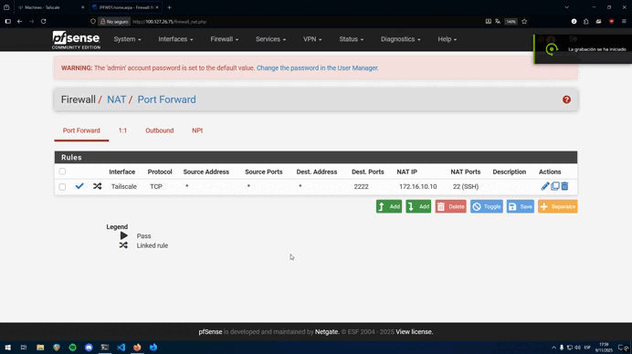
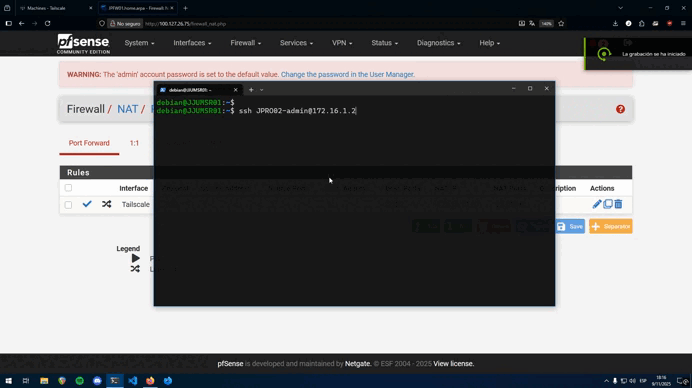

# :octicons-lock-16: Bastion (Jump Server)

El servidor bastion (también conocido como "jump server" o "jump host") es un componente de seguridad crítico en la topología. Actúa como la **única puerta de entrada** autorizada a la red de gestión (`172.16.10.0/24`) desde redes externas o menos seguras.

## 1. Propósito y Diseño de Seguridad

**El problema:** Los dispositivos de red (routers, switches) no deben ser accesibles directamente desde cualquier red. Exponer SSH de un router a una red de usuarios o a Internet es un riesgo de seguridad enorme.

**La solución:**

1.  **Aislamiento:** Las interfaces de gestión de los routers y switches (ej. `JPROO2`, `JPSWC01`) solo tienen conectividad por SSH en la VLAN de Sysadmin (`172.16.10.0/24`). 

  *Esta es la configuración que se debe de aplicar en los router y switches de la topología, creando una access-list:*
  ```
    conf t
    ip access-list standard ADMIN_ONLY
    permit host 172.16.10.10 !Ip del servidor de bastión
    line vty 0 4
    access-class ADMIN_ONLY in
    exit
  ```

2.  **Acceso Remoto Seguro (Tailscale):**
    Se utiliza **Tailscale** (una VPN) para el acceso remoto. El servicio de Tailscale está activo tanto en el firewall **pfSense** (`JPFW01`) como en el **equipo personal** del administrador. Esto crea un túnel seguro sin exponer ningún puerto directamente a Internet.

3.  **Punto de Acceso Único (Port Forwarding):**
    Para acceder al bastion, se utiliza una regla de **Port Forwarding** (NAT) en el pfSense.
    * El administrador inicia una conexión SSH a la IP de Tailscale del firewall pfSense.
    * Una regla de Port Forwarding en pfSense captura ese tráfico (dirigido al puerto 2222 de la interfaz Tailscale) y lo **redirige** a la IP interna del servidor bastion (`172.16.10.10`).
    * De esta forma, el bastion sigue estando totalmente aislado en su VLAN de gestión, y el pfSense actúa como el único intermediario seguro.

*Aquí se puede ver el flujo de acceso completo, desde el cliente hasta el bastion:*



---

## 2. Flujo de Conexión

Para entrar a un router por ejemplo, el administrador debe seguir este proceso:

1.  El administrador se conecta por SSH al servidor **Bastion**.
2.  Una vez *dentro* del bastion, el administrador "salta" (jump) al dispositivo deseado (ej. `ssh JPRO02-admin@172.16.1.2`). Aquí entrariamos al Router cisco encargado del enrutamiento entre vlans. 

*Aquí se puede ver el flujo de acceso desde el bastion hasta el router cisco:*



---

## 3. Configuración del Servidor

El bastion es un servidor Linux (Debian) mínimo, desplegado en la VLAN 10 (Sysadmin).

* **Host:** `JJUMSRV01` 
* **VLAN:** 10 (Sysadmin)
* **IP:** `172.16.10.10`
* **Gateway:** `172.16.10.1`

### 3.1. Compatibilidad SSH con Dispositivos Antiguos (Cisco)

Al intentar conectar desde el bastion (Debian moderno) a los dispositivos Cisco (con IOS antiguo), la conexión falla. Esto se debe a que los clientes SSH modernos han deshabilitado algoritmos de cifrado y claves de host (basados en SHA-1) que los dispositivos antiguos ofrecen, resultando en errores como:

* `no matching key exchange method found. Their offer: diffie-hellman-group14-sha1`
* `no matching host key type found. Their offer: ssh-rsa`

**Solución:**
Para forzar al cliente SSH del bastion a aceptar estos algoritmos viejos *solo* para esos dispositivos, se edita el archivo `~/.ssh/config` del usuario en el servidor bastion.

```title="~/.ssh/config (en el Bastion)"
# --- Configuración para JPROO2 ---
Host 10.255.255.2
  HostName 10.255.255.2
  User JPRO02-admin
  KexAlgorithms +diffie-hellman-group14-sha1
  HostKeyAlgorithms +ssh-rsa

# --- Configuración para JPSWC01 ---
Host 172.16.1.3
  HostName 172.16.1.3
  User JPSWC01-admin
  KexAlgorithms +diffie-hellman-group14-sha1
  HostKeyAlgorithms +ssh-rsa

# --- Configuración para JPSWA01 ---
Host 172.16.1.4
  HostName 172.16.1.4
  User JPSWA01-admin
  KexAlgorithms +diffie-hellman-group14-sha1
  HostKeyAlgorithms +ssh-rsa  
```

> En el caso para el router VyOS y PfSense no sería necesario está config, no aplica.