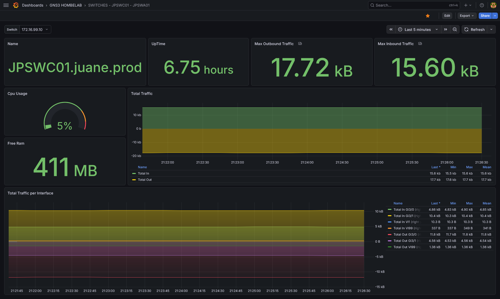
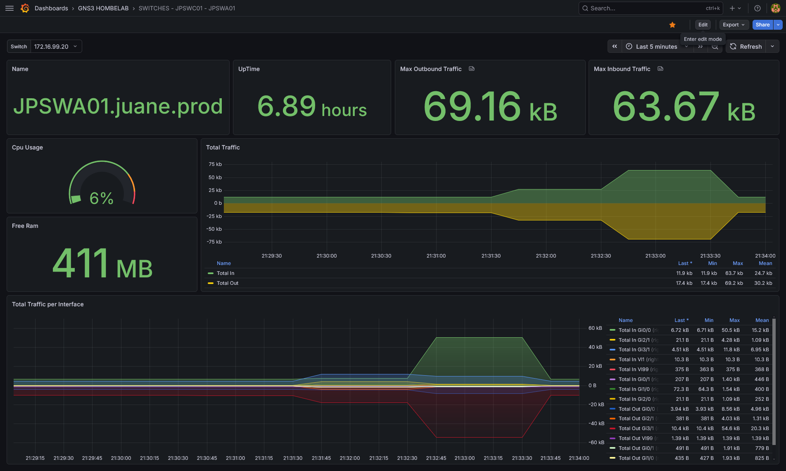
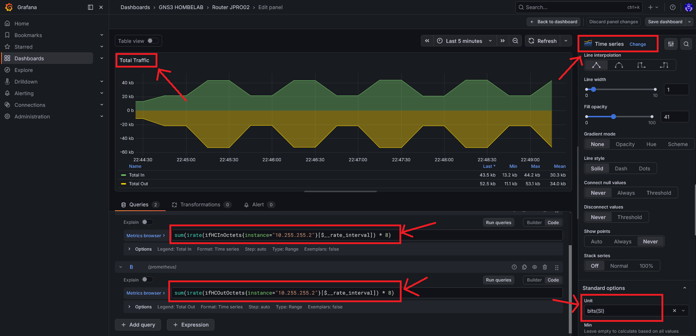

# :octicons-meter-16: Grafana & Prometheus

> **URL de Acceso:** `https://grafana.js-lab-uy.duckdns.org`

Este stack proporciona **Observabilidad** de la red. A diferencia de Uptime Kuma (que solo verifica si un equipo responde), este sistema recolecta métricas históricas detalladas: consumo de ancho de banda, carga de CPU por núcleo, uso de memoria RAM y estabilidad de las peticiones SNMP.

Este servicio se ejecuta en una instancia de **Oracle Cloud Infrastructure (OCI)**, fuera de la red local en GNS3 del laboratorio.
    
La conexión con los dispositivos locales se realiza a través de un túnel **Tailscale**.

## :fontawesome-solid-diagram-project: Arquitectura de Red

* **No hay puertos expuestos a Internet:** Los puertos 3000 (Grafana) y 9090 (Prometheus) no están abiertos en el firewall de Oracle.
* **Acceso Público y VPN:** Para ver los dashboards en grafana se expone publicamente el endpoint `https://grafana.js-lab-uy.duckdns.org`, mientras que para acceder a prometheus y snmp exporter, es obligatorio estar conectado a la red Tailscale.
* **Recolección de Datos:** Prometheus (en la nube) alcanza las IPs privadas de la LAN (`192.168.1.x`) enrutando el tráfico a través del nodo Tailscale local (Subnet Router).


***Capturas de pantalla de los Switches (JPSWA01, JPSWC01) de la topología***





## Pasos que realicé para la configuración e implementación

Primero ejecutamos un apt update para actualizar los paquetes del sistema:

```bash
sudo apt update -y
```

Una vez actualizados los paquetes, ya podemos instalar tailscale desde la página oficial [https://tailscale.com/download](https://tailscale.com/download):

```bash
curl -fsSL [https://tailscale.com/install.sh](https://tailscale.com/install.sh) | sh
```

Ahora podemos ejecutar el comando sudo tailscale up:

```bash
sudo tailscale up
```

Hacemos click en el enlace:


> *Nos pedirá que ingresemos una cuenta personal y una vez seleccionada, nuestra máquina virtual de oracle estará dentro de nuestra tailnet.*

Luego por la consola debemos aceptar las rutas que está compartiendo/advirtiendo el firewall PfSense:


Aceptamos las rutas en la instancia de oracle con el comando:

```bash
sudo tailscale set --accept-routes
```

Posteriormente ya podremos hacerle ping a la interfaz de loopback que tiene nuestro router JPRO02, de nuestra topología local en GNS3:


Una vez actualizado el sistema e instalado tailscale debemos instalar el paquete **`snmp`**  que contiene la herramienta `snmpwalk`:

```bash
sudo apt install snmp
```

Entonces ahora si podemos utilizar la herramienta `snmpwalk`.

En un dispositivo remoto de nuestra red interna, por ejemplo el PfSense se parametriza así:

```bash
snmpwalk -v 2c -c public 192.168.1.1
```

- `v`: Especifica la versión de SNMP (1, 2c, o 3). En este caso configuramos en todos los equipos para que utilice la segunda versión.
- `c`: La cadena comunitaria (community string), como `public` o `private`. En este caso es public.
- `IP_o_Hostname`: La dirección del dispositivo a consultar.

Luego de esto crearemos una carpeta donde estarán el archivo compose para snmp_exporter que desplegaremos con docker:

```bash
sudo mkdir -p /opt/docker/snmp-exporter
```

Ahora si ya podemos crear nuestro archivo docker-compose con cualquier editor de texto, y pegamos este fragmento en esta ruta /opt/docker/snmp-exporter:

```yaml
services:
  snmp-exporter:
    container_name: snmp-exporter
    image: prom/snmp-exporter:v0.30.1
    ports:
      - 9116:9116
    volumes:
      - ./config:/etc/snmp-exporter
    command: --config.file=/etc/snmp-exporter/snmp.yml
    restart: unless-stopped
    networks:
      - monitoring_network

networks:
  monitoring_network:
    external: true
```

Una vez guardado los cambios del docker-compose.yml, ahora podemos volver a nuestro directorio home y ya podemos clonar el repositorio con el proyecto llamado generador snmp, el cual nos ayudará muchísimo para generar nuestra configuración SNMP que necesitamos para alimentar a nuestro contenedor:

Primero creamos un directorio y nos movemos a el:

```bash
mkdir monitoring-snmp && cd monitoring-snmp
```

Dentro de ese directorio clonamos el repositorio de github:

```bash
git clone https://github.com/prometheus/snmp_exporter.git
```

Una vez clonado el repositorio dentro de la carpeta snmp_exporter tendremos todo el código fuente para el generador, aunque primero necesitaremos instalar algunas dependencias para poder compilar el generador:

```bash
sudo apt-get install unzip build-essential libsnmp-dev -y
```

Nos movemos a la carpeta generator ahora:

```bash
cd generator
```


Ahora ya podemos  compilar el generador y procesar los MIBs. Para entender la importancia de esto, pensemos en los **MIBs**  como si fueran el sistema DNS de las redes o un diccionario de traducción.

>Los dispositivos de red se comunican internamente utilizando **OIDs (Object Identifiers)**, que son largas cadenas numéricas jerárquicas difíciles de memorizar para un humano. Los archivos MIB actúan como un mapa que traduce esas cadenas numéricas a nombres legibles (por ejemplo, traduce `.1.3.6.1.2.1.1.5.0` a `sysName`). Al compilar los MIBs, permitimos que el generador entienda qué métricas estamos solicitando por su nombre y sepa exactamente qué dirección numérica pedirle al dispositivo. Esto nos ayuda a trabajar únicamente con los **nombres de las métricas definidos en los MIBs**, sin necesidad de memorizar o buscar manualmente la compleja cadena numérica de cada OID.

Entonces se ejecuta el siguiente comando:

```bash
make generator mibs
```

Entonces cuando tengamos el compilador en funcionamiento, ya podremos generar nuestra configuración SNMP, se creará un binario.

En caso de que tire un error como este por ejemplo:


Primero verificamos si tenemos go instalado, en caso que no, lo instalamos:


Y para eso lo que hacemos es descargar la versión 1.23.5 utilizando wget, es necesaria esa versión para garantizar la compatibilidad con el código del repositorio:

```bash
wget https://go.dev/dl/go1.23.5.linux-amd64.tar.gz
```

Entonces lo descomprimimos ahora:

```bash
sudo tar -C /usr/local -xzf go1.23.5.linux-amd64.tar.gz
```

Agregamos /usr/local/go/bin a la variable de entorno PATH:

```bash
export PATH=$PATH:/usr/local/go/bin
```

Y si escribimos go version nos mostrará la version instalada:

```bash
ubuntu@JMONSR02:~/monitoring-snmp/snmp_exporter/generator$ go version
go version go1.24.0 linux/amd64
```

Una vez instalado go, ya podremos lanzar de nuevo el comando:

```bash
make generator mibs
```

El cuál nos generará el binario compilado y listo para usar:


Ahora ya podemos crear nuestra configuración SNMP, editando el archivo generator.yml, por las dudas hacemos una copia de ese archivo:

```bash
cp generator.yml generator.yml.bkp
```

Lo editamos con cualquier editor de texto:


En nuestro caso podemos dejar la autenticación por defecto que ya trae, para este caso configuramos la versión 2 para todos los dispositivos de la red.

Entonces debemos establecer el recorrido y poner las métricas específicas que se quieran obtener, por ejemplo:


```yaml title="generator.yml"
---
auths:
  public_v2:
    version: 2

modules:
  # MÓDULO PARA VyOS, pfSense y Linux
  nix_device:
    walk:
      - "SNMPv2-MIB::sysUpTime"              # UpTime
      - "SNMPv2-MIB::sysName"                # Name
      - "IF-MIB::ifXTable"                   # 64 bits meter
      - "HOST-RESOURCES-MIB::hrProcessorLoad" # CPU load
      - "HOST-RESOURCES-MIB::hrStorageTable"  # RAM, Disks
    lookups:
      - source_indexes: [ifIndex]
        lookup: "IF-MIB::ifName"
      - source_indexes: [ifIndex]
        lookup: "IF-MIB::ifAlias"
      - source_indexes: [hrStorageIndex]
        lookup: hrStorageDescr
        drop_source_indexes: false
    overrides:
      ifAlias:
        ignore: true # Lookup metric
      ifDescr:
        ignore: true # Lookup metric
      ifName:
        ignore: true # Lookup metric

  # MÓDULO PARA EQUIPOS CISCO (Router y Switch)
  cisco_device:
    walk:
      - "SNMPv2-MIB::sysUpTime"
      - "SNMPv2-MIB::sysName"
      - "IF-MIB::ifXTable"
      - "CISCO-PROCESS-MIB::cpmCPUTotal5minRev"
      - "CISCO-MEMORY-POOL-MIB::ciscoMemoryPoolFree"
      - "CISCO-MEMORY-POOL-MIB::ciscoMemoryPoolUsed"
      - "OLD-CISCO-SYS-MIB::avgBusy5"
      - "OLD-CISCO-SYS-MIB::freeMem"
    lookups:
      - source_indexes: [ifIndex]
        lookup: "IF-MIB::ifName"
      - source_indexes: [ifIndex]
        lookup: "IF-MIB::ifAlias"
    overrides:
      ifAlias:
        ignore: true # Lookup metric
      ifDescr:
        ignore: true # Lookup metric
      ifName:
        ignore: true # Lookup metric
```

donde cada una tiene un significado en especial:

### Información del Sistema y Red

- **sysUpTime**: Tiempo encendido (dispositivo).
- **sysName**: Nombre de host configurado en el dispositivo.

### Interfaces y Tráfico (Común para ambos)

- **ifXTable**: Tabla extendida de interfaces.

    > Nota: Al traer esta tabla, obtienes automáticamente `ifHCInOctets` y `ifHCOutOctets` (los contadores de 64 bits necesarios para medir velocidades de 1Gbps o más sin errores).
    > 
    > También trae: `ifName` (Nombre de la interfaz) y `ifAlias` (Descripción de la interfaz).

- **ifHCInOctets**: Tráfico entrante (bytes).
- **ifHCOutOctets**: Tráfico saliente (bytes).
- **ifName**: Nombre de la interfaz.
- **ifAlias**: Descripción de la interfaz.

### Módulo VyOS / Linux (nix_device)

- **hrProcessorLoad**: Carga del procesador.
    - **Detalle:** Muestra el % de uso de cada núcleo de la CPU individualmente.

- **hrStorageTable**: Tabla de almacenamiento unificada.
    - **Detalle:** En Linux/VyOS, esto incluye tanto Discos Duros (sistema de archivos) como Memoria RAM (Physical memory). Por eso usamos filtros luego para separarlos.

### Módulo Cisco (cisco_device)

- **cpmCPUTotal5minRev**: Uso de CPU (Cisco Moderno).
    - **Detalle:** Promedio de uso de CPU en los últimos 5 minutos (Estándar recomendado para Cisco).

- **ciscoMemoryPoolFree**: Memoria Libre (Cisco Moderno).
    - **Detalle:** Cantidad de bytes libres en el pool de memoria.

- **ciscoMemoryPoolUsed**: Memoria Usada (Cisco Moderno).
    - **Detalle:** Cantidad de bytes ocupados.

- **avgBusy5**: Uso de CPU (Cisco Legacy).
    - **Detalle:** Métrica antigua para routers viejos que no soportan la MIB moderna.

- **freeMem**: Memoria Libre (Cisco Legacy).
    - **Detalle:** La métrica "vieja" para equipos que no soportan MemoryPool.

Ahora cerramos y guardamos el archivo, y ya podremos ejecutar el generador:

```bash
./generator -m mibs generate
```

Esto nos generará un archivo llamado snmp.yml:


Bien entonces el siguiente paso es levantar el contenedor y la configuración, para eso volvemos al directorio: 

```bash
cd /opt/docker/snmp-exporter
```

Y antes de iniciar el contenedor, crearemos una carpeta llamada config:

```bash
mkdir config 
```

Luego, lo que hacemos es copiar el archivo snmp.yml que se generó automaticamente a la ubicación actual, el directorio config:

```bash
sudo cp /home/ubuntu/monitoring-snmp/snmp_exporter/generator/snmp.yml  .
```

Ahora ya podemos crear la carpeta prometheus y su compose dentro de /opt/docker/:

```bash
mkdir prometheus && cd prometheus
```

Creamos el archivo docker-compose.yml utilizando cualquier editor de texto, y pegamos lo siguiente:

```yaml
services:
  prometheus:
    image: prom/prometheus:v3.9.1
    container_name: prometheus
    ports:
      - 9090:9090
    volumes:
      - ./prometheus:/etc/prometheus
      - ./prometheus-data:/prometheus
    command: "--config.file=/etc/prometheus/prometheus.yml"
    restart: unless-stopped
    networks:
      - monitoring_network

networks:
  monitoring_network:
    driver: bridge
    name: monitoring_network

```

Luego creamos una carpeta llamada prometheus-data:

```bash
mkdir prometheus-data
```

Le otorgamos permisos de lectura, escritura y ejecución:

```bash
chmod 777 prometheus-data
```

Y ahora dentro de /opt/docker/prometheus, creamos otra carpeta prometheus que contendrá el prometheus.yml:

```bash
mkdir prometheus && cd prometheus
```

Posteriormente utilizando creamos el archivo prometheus.yml y pegamos el siguiente contenido:

```yaml
global:
  scrape_interval: 30s

scrape_configs:
  # JOB 1: Equipos VyOS y PfSense
  - job_name: 'Vyos and PfSense'
    scrape_interval: 60s      # Escanea cada 1 minuto (menos carga al CPU de GNS3)
    scrape_timeout: 30s       
    static_configs:
      - targets:
        - 10.255.255.1  
        - 192.168.1.1   
    metrics_path: /snmp
    params:
      auth: [public_v2]
      module: [nix_device]
    relabel_configs:
      - source_labels: [__address__]
        target_label: __param_target
      - source_labels: [__param_target]
        target_label: instance
      - target_label: __address__
        replacement: snmp-exporter:9116

  # JOB 2: Equipos Cisco
  - job_name: 'Router Cisco'
    static_configs:
      - targets:
        - 10.255.255.2
    metrics_path: /snmp
    params:
      auth: [public_v2]
      module: [cisco_device]
    relabel_configs:
      - source_labels: [__address__]
        target_label: __param_target
      - source_labels: [__param_target]
        target_label: instance
      - target_label: __address__
        replacement: snmp-exporter:9116

# JOB 3: Equipos Cisco
  - job_name: 'Switches Cisco'
    scrape_interval: 60s      
    scrape_timeout: 30s       
    static_configs:
      - targets:
        - 172.16.99.10
        - 172.16.99.20
    metrics_path: /snmp
    params:
      auth: [public_v2]
      module: [cisco_device]
    relabel_configs:
      - source_labels: [__address__]
        target_label: __param_target
      - source_labels: [__param_target]
        target_label: instance
      - target_label: __address__
        replacement: snmp-exporter:9116
```

Una vez guardado ahora ya podemos levantar el contenedor utilizando docker-compose:

```bash
docker-compose up -d 
```


Ahora se encuentra en ejecución, y podemos ingresar a la interfaz gráfica utilizando la ip que nos proporciona tailscale e indicamos el puerto 9090 que está escuchando nuestro contenedor de prometheus `http://100.103.72.38:9090/`: 


Posteriormente ahora también ya podemos levantar el contenedor snmp_exporter que creamos en pasos anteriores:


También podemos ingresar a la página con la ip de tailscale y el puerto 9116 `http://100.103.72.38:9090/`


Ahora en este paso incluso ya podemos probar si estamos obteniendo las métricas, entonces en target ponemos la ip de nuestro dispositivo por ejemplo 10.255.255.2 (JPRO02), en auth dejamos el public_v2 que quedó definido desde un principio y en módulo escribimos cisco_device:


Entonces cuando le damos a Submit, nos devuelve un bloque de los datos que está obteniendo, esto es un pequeño fragmento de las métricas que estamos obteniendo de nuestro router.

Una vez que eso está funcionando ya podemos volver a la carpeta /opt/docker/ y dentro de ella crearemos una llamada Grafana:

```bash
mkdir grafana && cd grafana 
```

Dentro de ella creamos nuestro archivo docker-compose.yml utilizando nano o vim, y pegamos el siguiente contenido:

```yaml
services:
  grafana:
    image: grafana/grafana:12.4.0-20904407122-ubuntu
    container_name: grafana
    restart: unless-stopped
    ports:
      - '3000:3000'
    environment:
      GF_RENDERING_SERVER_URL: http://grafana-image-renderer:8081/render
      GF_RENDERING_CALLBACK_URL: http://grafana:3000/
    volumes:
      - grafana-storage:/var/lib/grafana

    networks:
      - monitoring_network
volumes:
  grafana-storage: {}

networks:
  monitoring_network:
    external: true
```

Listo, ahora si podremos levantar nuestro contenedor con la herramienta `docker-compose up`:


Ingresando con la ip de tailscale y el puerto 3000 que está escuchando el contenedor de grafana, podremos acceder al dashboard desde un navegador:


Ahora es el momento de crear los paneles con graficas, gauge y stats, de nuesotro firewall PfSense en este caso, para eso primero debemos linkear Prometheus como fuente de datos, osea conectar Prometheus como fuente de datos en Grafana.

Hacemos click en data sources:


Ahora clickeamos el botón azul que dice Add data source:


Elegimos Prometheus:


y en la ventana que se nos abre, en el campo connection debemos poner el nombre del contenedor de prometheus que definimos en su archivo docker-compose.yml, y también indicamos el puerto, en este caso 9090:


y si hacemos click en el botón save & test:


Como podemos ver ya quedó establecido prometheus como fuente de datos, ahora solo queda constuir el panel para el firewall pfsense.

Ahora hacemos click en Dashboards y le damos en new:


le damos click en new visualization:


aquí seleccionamos prometheus como la fuente de datos:


bien, ahora ya podemos comenzar a crear un panel, comenzaremos con el nombre del dispositivo, en este ejemplo lo haremos para el router cisco JPRO02 de la topología:

### Stat - Nombre del Dispositivo Panel


Tipo de Visualización

* **Stat**

 Panel Options -> Title

* **Name**

Query (PromQL)

```promql
sysName{instance="10.255.255.2"}
```

Options -> Legend

```
{{sysName}}
```

---

### Stat - Tiempo de Encendido Panel

Luego para el tiempo de encendido el panel es el siguiente:


Tipo de Visualización

* **Stat**

 Panel Options -> Title

* **UpTime**

Query (PromQL)

```promql
sysUpTime{instance="10.255.255.2"} * 10
```
>!!! note
    aqui se multiplica por 10 porque en SNMP viene en centesimas por segundos,
    multiplicar por 10 lo convierte en milésimas (Milisegundos).

Standard options -> unit -> milliseconds (ms)

---

### Stat - Pico Máximo de Tráfico de Salida Panel

Ahora crearemos un panel que nos muestra el pico de salida (subida), máximo del router que tuvo en el promedio de 2 minutos


Tipo de Visualización

* **Stat**

 Panel Options -> Title

* **Max Outbound Traffic**

Query (PromQL)

```promql
max_over_time(sum(rate(ifHCOutOctets{instance="10.255.255.2"}[2m]))[$__range:]) * 8
```
>!!! note
    Esta query toma la velocidad de salida de todas las interfaces sumadas, busca el pico más alto registrado en el periodo de tiempo seleccionado y lo multiplica por 8 para mostrarlo en Bits por segundo.

Standard options -> unit -> bytes (SI)

!!! info
    Para el panel que muestra el máximo de pico de entrada se hace exactamente igual, solo que en la consulta se utiliza la siguiente: 
    ```max_over_time(sum(rate(ifHCInOctets{instance="10.255.255.2"}[2m]))[$__range:]) * 8```

---

### Gauge - Uso de CPU Panel

Ahora crearemos el panel para ver el uso de la CPU del router


Tipo de Visualización

* **Gauge**

Panel Options → Title

* **CPU Usage**

Query (PromQL)

```promql
cpmCPUTotal5minRev{instance="10.255.255.2"}
```

!!! note
    Esta métrica representa el porcentaje de uso total de CPU, calculado como un promedio inverso de los últimos 5 minutos para el dispositivo con IP 10.255.255.2.
    El valor devuelto ya se encuentra normalizado en un rango de 0 a 100, por lo que es ideal para visualizarse directamente en un Gauge.

Standard options -> unit -> Percent (0-100)

!!! info
    Al utilizar la unidad Percent (0-100), Grafana ajusta automáticamente la visualización del gauge para representar correctamente el consumo de CPU, permitiendo además definir umbrales (thresholds) visuales para estados normales, de advertencia o críticos.

Thresholds

- 🟢 **Verde**: 70 %
- 🟡 **Amarillo**: 75  %
- 🔴 **Rojo**: 90 %

Esta configuración permite identificar rápidamente estados de carga elevada de CPU.

--- 

### Gauge - Uso de Memoria RAM Panel

Posteriormente agregaremos un panel para ver el uso de memoria ram del dispositivo


Tipo de Visualización

* **Gauge**

Panel Options → Title

* **Memory Usage**

Query (PromQL)

```promql
100 *
sum(ciscoMemoryPoolUsed{instance="10.255.255.2"})
/
sum(
  ciscoMemoryPoolUsed{instance="10.255.255.2"}
  +
  ciscoMemoryPoolFree{instance="10.255.255.2"}
)
```

!!! note
    Esta consulta calcula el porcentaje de uso de memoria del dispositivo con IP 10.255.255.2- La fórmula funciona de la siguiente manera:
   - Se suma toda la memoria **usada** (`ciscoMemoryPoolUsed`)
   - Se suma la memoria **total**, compuesta por memoria usada + libre
   - El resultado se multiplica por **100** para obtener el valor en porcentaje

El valor final queda normalizado en un rango de **0 a 100**, ideal para visualización en un panel **Gauge**.

Standard options
Unit -> Percent (0-100)

!!! info
    Al utilizar la unidad Percent (0-100), Grafana interpreta correctamente los valores como porcentaje, permitiendo además aplicar umbrales visuales para identificar estados normales, de advertencia o críticos en el consumo de memoria.

Thresholds

- 🟢 **Verde**: 70 %
- 🟡 **Amarillo**: 75  %
- 🔴 **Rojo**: 90 %

Estos umbrales ayudan a detectar de forma temprana posibles problemas de saturación de memoria.

---

### Time series - Tráfico de Red Panel

El siguiente paso es crear gráficos de línea para monitorear el tráfico de red en tiempo real.



Tipo de Visualización

* **Time series**

Panel Options → Title

* **Total Traffic**

Query (PromQL)

```promql
sum(irate(ifHCInOctets{instance="10.255.255.2"}[$__rate_interval]) * 8)
```
**Legend**
Total in

```promql
sum(irate(ifHCOutOctets{instance="10.255.255.2"}[$__rate_interval]) * 8)
```

**Legend**
Total out

!!! note
    Estas consultas calculan la tasa de tráfico de red entrante y saliente en bits por segundo para el dispositivo con IP
    10.255.255.2. La función `irate()` estima la tasa instantánea basada en los últimos datos disponibles, y el resultado se multiplica por 8 para convertir bytes a bits.

Standard options
Unit -> bytes (SI)

**Overrides**


En el apartado de overrides, seleccionamos Fields with Name y escribimos Total Out, luego en Graph styles -> Transform, seleccionamos Negative Y, y obtenemos el panel adjuntado arriba.

---

Por ultimo, crearemos el dashboard que contiene el total de tráfico pero de cada interfaz del router JPRO02, tanto entrada como salida, para obtener algo mas detallado.


Tipo de Visualización

* **Time series**

Panel Options → Title

* **Total Traffic Per Interface**

Query (PromQL)

```promql
irate(ifHCInOctets{instance="10.255.255.2"}[2m]) * 8 > 0

```

**Legend**
Total in {{ifName}} 

```promql
irate(ifHCOutOctets{instance="10.255.255.2"}[2m]) * 8 > 0
```

**Legend**
Total out {{ifName}}

!!! note
    Estas consultas calculan la tasa de tráfico de red entrante y saliente en bits por segundo (bps) para cada interfaz del dispositivo, utilizando una ventana de 2 minutos y multiplicando por 8 para convertir de bytes a bits.

Standard options
Unit -> bytes (SI)

**Overrides**


En el apartado de overrides, seleccionamos Fields with Name y escribimos /.Out*/, luego en Graph styles -> Transform, seleccionamos Negative Y, y obtenemos el panel adjuntado arriba.

---

## Conclusión
¡Y con esto hemos finalizado la configuración del stack de Grafana y Prometheus para monitorear nuestros dispositivos de red a través de SNMP! Ahora podemos visualizar métricas detalladas y en tiempo real sobre el rendimiento y estado de nuestros equipos directamente desde los dashboards personalizados en Grafana. También obtendremos el mismo resultado haciendo con el resto de dispositivos de red.