# :octicons-meter-16: Grafana & Prometheus

Este stack proporciona la capa de **Observabilidad** de la red. A diferencia de Uptime Kuma (que solo verifica si un equipo responde), este sistema recolecta métricas históricas detalladas: consumo de ancho de banda, carga de CPU por núcleo, uso de memoria RAM y estabilidad de las peticiones SNMP.

Este servicio se ejecuta en una instancia de **Oracle Cloud Infrastructure (OCI)**, fuera de la red física del laboratorio.
    
La conexión con los dispositivos locales se realiza de forma segura y transparente a través de un túnel **Tailscale**.

## :fontawesome-solid-diagram-project: Arquitectura de Red

* **No hay puertos expuestos a Internet:** Los puertos 3000 (Grafana) y 9090 (Prometheus) no están abiertos en el firewall de Oracle.
* **Acceso VPN:** Para ver los dashboards o consultar datos, es obligatorio estar conectado a la red Tailscale.
* **Recolección de Datos:** Prometheus (en la nube) alcanza las IPs privadas de la LAN (`192.168.1.x`) enrutando el tráfico a través del nodo Tailscale local (Subnet Router).


***Capturas de pantalla de algunos de los paneles, en este caso JPRO01 y JPRO02***


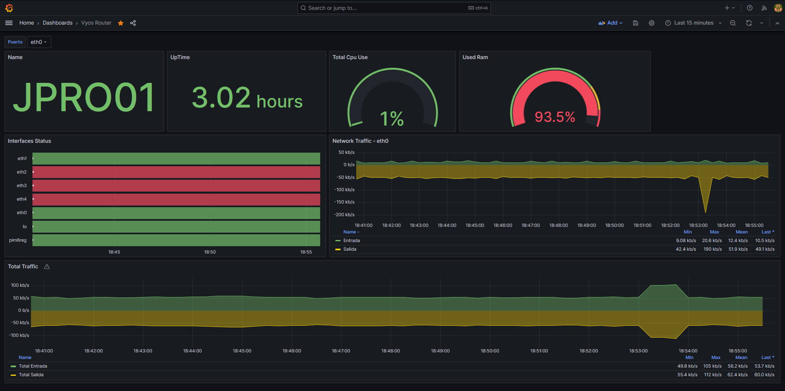

## Pasos que realicé para la configuración e implementación

Primero ejecutamos un apt update para actualizar los paquetes del sistema:

```bash
sudo apt update -y
```

Una vez actualizados los paquetes, ya podemos instalar tailscale desde la página oficial [https://tailscale.com/download](https://tailscale.com/download):

```bash
curl -fsSL [https://tailscale.com/install.sh](https://tailscale.com/install.sh) | sh
```

Ahora podemos ejecutar el comando sudo tailscale up:

```bash
sudo tailscale up
```

Hacemos click en el enlace:


> *Nos pedirá que ingresemos una cuenta personal y una vez seleccionada, nuestra máquina virtual de oracle estará dentro de nuestra tailnet.*

Luego por la consola debemos aceptar las rutas que está compartiendo/advirtiendo el firewall PfSense:


Aceptamos las rutas en la instancia de oracle con el comando:

```bash
sudo tailscale set --accept-routes
```

Posteriormente ya podremos hacerle ping a la interfaz de loopback que tiene nuestro router JPRO02, de nuestra topología local en GNS3:


Una vez actualizado el sistema e instalado tailscale debemos instalar el paquete **`snmp`**  que contiene la herramienta `snmpwalk`:

```bash
sudo apt install snmp
```

Entonces ahora si podemos utilizar la herramienta `snmpwalk`.

En un dispositivo remoto de nuestra red interna, por ejemplo el PfSense se parametriza así:

```bash
snmpwalk -v 2c -c public 192.168.1.1
```

- `v`: Especifica la versión de SNMP (1, 2c, o 3). En este caso configuramos en todos los equipos para que utilice la segunda versión.
- `c`: La cadena comunitaria (community string), como `public` o `private`. En este caso es public.
- `IP_o_Hostname`: La dirección del dispositivo a consultar.

Luego de esto crearemos una carpeta donde estarán el archivo compose para snmp_exporter que desplegaremos con docker:

```bash
sudo mkdir -p /opt/docker/snmp-exporter
```

Ahora si ya podemos crear nuestro archivo docker-compose con cualquier editor de texto, y pegamos este fragmento en esta ruta /opt/docker/snmp-exporter:

```yaml
services:
  snmp-exporter:
    container_name: snmp-exporter
    image: quay.io/prometheus/snmp-exporter:v0.27.0
    ports:
      - 9116:9116
    volumes:
      - ./config:/etc/snmp-exporter
    command: --config.file=/etc/snmp-exporter/snmp.yml
    restart: unless-stopped
    networks:
      - monitoring_network

networks:
  monitoring_network:
    external: true
```

Una vez guardado los cambios del docker-compose.yml, ahora podemos volver a nuestro directorio home y ya podemos clonar el repositorio con el proyecto llamado generador snmp, el cual nos ayudará muchísimo para generar nuestra configuración SNMP que necesitamos para alimentar a nuestro contenedor:

Primero creamos un directorio y nos movemos a el:

```bash
mkdir monitoring-snmp && cd monitoring-snmp
```

Dentro de ese directorio clonamos el repositorio de github:

```bash
git clone [https://github.com/prometheus/snmp_exporter.git](https://github.com/prometheus/snmp_exporter.git)
```

Una vez clonado el repositorio dentro de la carpeta snmp_exporter tendremos todo el código fuente para el generador, aunque primero necesitaremos instalar algunas dependencias para poder compilar el generador:

```bash
sudo apt-get install unzip build-essential libsnmp-dev -y
```

Nos movemos a la carpeta generator ahora:

```bash
cd generator
```


Ahora ya podemos  compilar el generador y procesar los MIBs. Para entender la importancia de esto, pensemos en los **MIBs**  como si fueran el sistema DNS de las redes o un diccionario de traducción.

>Los dispositivos de red se comunican internamente utilizando **OIDs (Object Identifiers)**, que son largas cadenas numéricas jerárquicas difíciles de memorizar para un humano. Los archivos MIB actúan como un mapa que traduce esas cadenas numéricas a nombres legibles (por ejemplo, traduce `.1.3.6.1.2.1.1.5.0` a `sysName`). Al compilar los MIBs, permitimos que el generador entienda qué métricas estamos solicitando por su nombre y sepa exactamente qué dirección numérica pedirle al dispositivo. Esto nos ayuda a trabajar únicamente con los **nombres de las métricas definidos en los MIBs**, sin necesidad de memorizar o buscar manualmente la compleja cadena numérica de cada OID.

Entonces se ejecuta el siguiente comando:

```bash
make generator mibs
```

Entonces cuando tengamos el compilador en funcionamiento, ya podremos generar nuestra configuración SNMP, se creará un binario.

En caso de que tire un error como este por ejemplo:


Primero verificamos si tenemos go instalado, en caso que no, lo instalamos:


Y para eso lo que hacemos es descargar la versión 1.23.5 utilizando wget, es necesaria esa versión para garantizar la compatibilidad con el código del repositorio:

```bash
wget [https://go.dev/dl/go1.23.5.linux-amd64.tar.gz](https://go.dev/dl/go1.23.5.linux-amd64.tar.gz)
```

Entonces lo descomprimimos ahora:

```bash
sudo tar -C /usr/local -xzf go1.23.5.linux-amd64.tar.gz
```

Agregamos /usr/local/go/bin a la variable de entorno PATH:

```bash
export PATH=$PATH:/usr/local/go/bin
```

Y si escribimos go version nos mostrará la version instalada:

```bash
ubuntu@JMONSR02:~/monitoring-snmp/snmp_exporter/generator$ go version
go version go1.24.0 linux/amd64
```

Una vez instalado go, ya podremos lanzar de nuevo el comando:

```bash
make generator mibs
```

El cuál nos generará el binario compilado y listo para usar:


Ahora ya podemos crear nuestra configuración SNMP, editando el archivo generator.yml, por las dudas hacemos una copia de ese archivo:

```bash
cp generator.yml generator.yml.bkp
```

Lo editamos con cualquier editor de texto:


En nuestro caso podemos dejar la autenticación por defecto que ya trae, para este caso configuramos la versión 2 para todos los dispositivos de la red.

Entonces debemos establecer el recorrido y poner las métricas específicas que se quieran obtener, por ejemplo:


donde cada una tiene un significado en especial:

### Información del Sistema y Red

- **sysUpTime**: Tiempo encendido (dispositivo).
- **interfaces**: Lista de puertos/red.
- **ifXTable**: Detalles extendidos (interfaces).
- **sysName**: Nombre del equipo.

### Tráfico de Red (Contadores de 64 bits)

- **ifHCInOctets**: Tráfico entrante (bytes).
- **ifHCOutOctets**: Tráfico saliente (bytes).

### Errores de Red

- **ifInErrors**: Errores entrada (paquetes).
- **ifOutErrors**: Errores salida (paquetes).

### Uso de Procesador (CPU)

- **ssCpuUser**: Uso por aplicaciones.
- **ssCpuSystem**: Uso por núcleo (kernel).
- **ssCpuIdle**: CPU libre/ociosa.

### Memoria RAM

- **memTotalReal**: Memoria RAM total.
- **memAvailReal**: Memoria RAM disponible.
- **memBuffer**: Datos temporales (I/O).
- **memCached**: Datos en caché.

Ahora cerramos y guardamos el archivo, y ya podremos ejecutar el generador:

```bash
./generator -m mibs generate
```

Esto nos generará un archivo llamado snmp.yml:


Sí lo abrimos esto es un extracto de su contenido, bastante similar al del generador.yml:


Bien entonces el siguiente paso es levantar el contenedor y la configuración, para eso volvemos al directorio: 

```bash
cd /opt/docker/snmp-exporter
```

Y antes de iniciar el contenedor, crearemos una carpeta llamada config:

```bash
mkdir config 
```

Luego, lo que hacemos es copiar el archivo snmp.yml que se generó automaticamente a la ubicación actual, el directorio config:

```bash
sudo cp /home/ubuntu/monitoring-snmp/snmp_exporter/generator/snmp.yml  .
```

Ahora ya podemos crear la carpeta prometheus y su compose dentro de /opt/docker/:

```bash
mkdir prometheus && cd prometheus
```

Creamos el archivo docker-compose.yml utilizando cualquier editor de texto, y pegamos lo siguiente:

```yaml
services:
  prometheus:
    image: prom/prometheus:v2.53.0
    container_name: prometheus
    ports:
      - 9090:9090
    volumes:
      - ./prometheus:/etc/prometheus
      - ./prometheus-data:/prometheus
    command: "--config.file=/etc/prometheus/prometheus.yml"
    restart: unless-stopped
    networks:
      - monitoring_network

networks:
  monitoring_network:
    driver: bridge

```

Luego creamos una carpeta llamada prometheus-data:

```bash
mkdir prometheus-data
```

Le otorgamos permisos de lectura, escritura y ejecución:

```bash
chmod 777 prometheus-data
```

Y ahora dentro de /opt/docker/prometheus, creamos otra carpeta prometheus que contendrá el prometheus.yml:

```bash
mkdir prometheus && cd prometheus
```

Posteriormente utilizando creamos el archivo prometheus.yml y pegamos el siguiente contenido:

```yaml
global:
  scrape_interval: 15s

scrape_configs:
  - job_name: 'snmp_general'
    static_configs:
      - targets:
        - 10.255.255.1  # Router Vyos
        - 192.168.1.1   # PfSense
    metrics_path: /snmp
    params:
      auth: [public_v2]
      module: [if_mib]  
    relabel_configs:
      - source_labels: [__address__]
        target_label: __param_target
      - source_labels: [__param_target]
        target_label: instance
      - target_label: __address__
        replacement: snmp-exporter:9116
```

Una vez guardado ahora ya podemos levantar el contenedor utilizando docker-compose:

```bash
docker-compose up -d 
```


Ahora se encuentra en ejecución, y podemos ingresar a la interfaz gráfica utilizando la ip que nos proporciona tailscale e indicamos el puerto 9090 que está escuchando nuestro contenedor de prometheus `http://100.100.152.8:9090/`: 


Posteriormente ahora también ya podemos levantar el contenedor snmp_exporter que creamos en pasos anteriores:

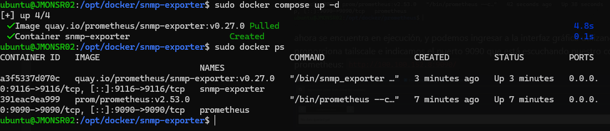

También podemos ingresar a la página con la ip de tailscale y el puerto 9116 [`http://100.100.152.8:9116/`](http://100.100.152.8:9116/)

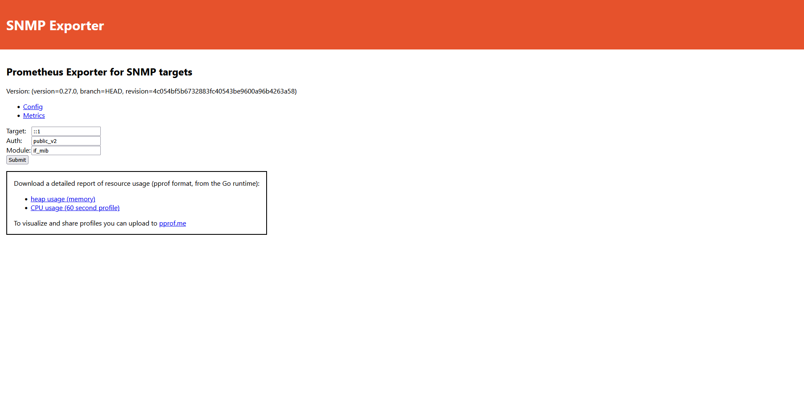

Ahora en este paso incluso ya podemos probar si estamos obteniendo las métricas, entonces en target ponemos la ip de nuestro dispositivo por ejemplo 192.168.1.1 (PfSense), en auth dejamos el public_v2 que quedó definido desde un principio y en módulo también dejamos el de if_mib:


Entonces cuando le damos a Submit, nos devuelve un bloque de los datos que está obteniendo, esto es un pequeño fragmento de las métricas que estamos obteniendo de nuestro firewall PfSense:

Una vez que eso está funcionando ya podemos volver a la carpeta /opt/docker/ y dentro de ella crearemos una llamada Grafana:

```bash
mkdir grafana && cd grafana 
```

Dentro de ella creamos nuestro archivo docker-compose.yml utilizando nano o vim, y pegamos el siguiente contenido:

```yaml
services:
  grafana:
    image: grafana/grafana-oss:10.2.8
    container_name: grafana
    ports:
      - 3000:3000
    volumes:
      - ./grafana-data:/var/lib/grafana
    restart: unless-stopped
    networks:
      - monitoring_network

networks:
  monitoring_network:
    external: true
```

Ahora creamos un directorio llamado grafana-data:

```bash
mkdir grafana-data
```

Y le damos permisos de lectura, escritura y ejecución:

```bash
chmod 777 grafana-data
```

Listo, ahora si podremos levantar nuestro contenedor con la herramienta `docker-compose up`:

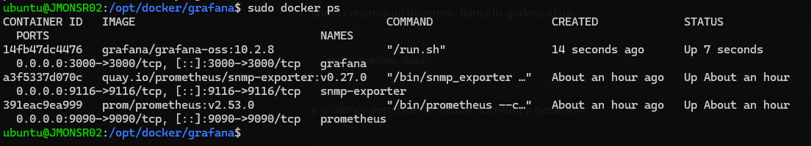

Ingresando con la ip de tailscale y el puerto 3000 que está escuchando el contenedor de grafana, podremos acceder al dashboard desde un navegador:


Ahora es el momento de crear los paneles con graficas, gauge y stats, de nuesotro firewall PfSense en este caso, para eso primero debemos linkear Prometheus como fuente de datos, osea conectar Prometheus como fuente de datos en Grafana.

Hacemos click en data sources:

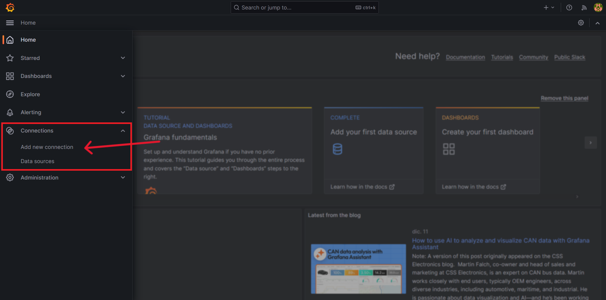

Ahora clickeamos el botón azul que dice Add data source:

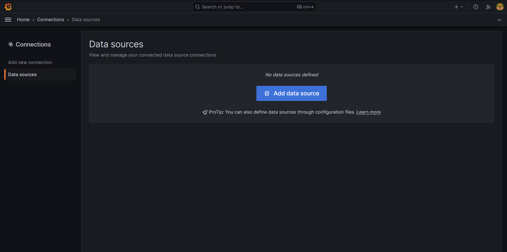

Elegimos Prometheus:


y en la ventana que se nos abre, en el campo connection debemos poner el nombre del contenedor de prometheus que definimos en su archivo docker-compose.yml, y también indicamos el puerto, en este caso 9090:


y si hacemos click en el botón save & test:


Como podemos ver ya quedó establecido prometheus como fuente de datos, ahora solo queda constuir el panel para el firewall pfsense.

Ahora hacemos click en Dashboards y le damos en new:


le damos click en new visualization:

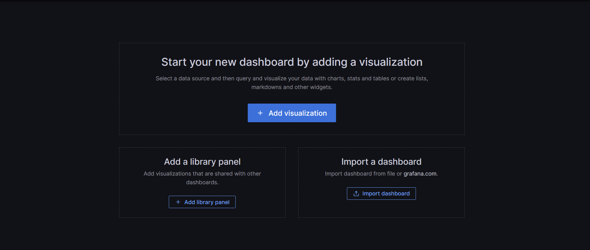

aquí seleccionamos prometheus como la fuente de datos:


bien y ahora para obtener el nombre como un gráfico del tipo stat:

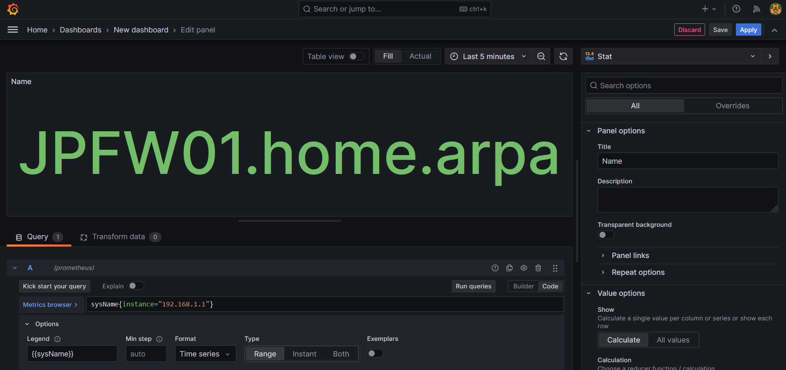

En la consulta PromQL y en las opciones ponemos lo siguiente:

Consulta (Code): `sysName{instance="192.168.1.1"}`

Options → Legend: {{sysName}}

El tipo de gráfico seleccionamos Stat


En donde dice Graph mode dejamos none para que no se vea la linea verde horizontal abajo y en Text mode ponemos Name, sino se verá un número en el gráfico y no es lo que buscamos.

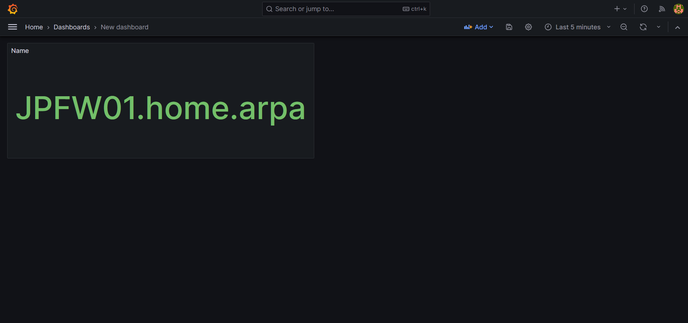

Ahí ya tenemos obtuvimos el hostname de PfSense

Ahora agregaremos otro para el tiempo de encendido del dispositivo, para eso agregamos otra visualización:


Consulta:`sysUpTime{instance="192.168.1.1"} * 10`

### Tipo de Panel (Visualización)

En la esquina superior derecha del editor, cambia el tipo de visualización a **Stat**.

onfiguración del Panel (Panel options)

En la columna de la derecha, ajusta estos campos clave:

- **Panel options > Title:** `UpTime`.
- **Value options > Calculation:** `Last*` (para que muestre el valor más reciente).
- **Standard options > Unit:** Busca y selecciona **Time / milliseconds (ms)**.
    
    > ¿Por qué ms? Como vimos antes, al multiplicar las centésimas de SNMP por 10, el resultado está en milisegundos. Grafana detectará esto y convertirá automáticamente el número a "mins", "hours" o "days" según corresponda.
    > 


ahora agregamos otra visualización pero para ver el uso de la CPU:

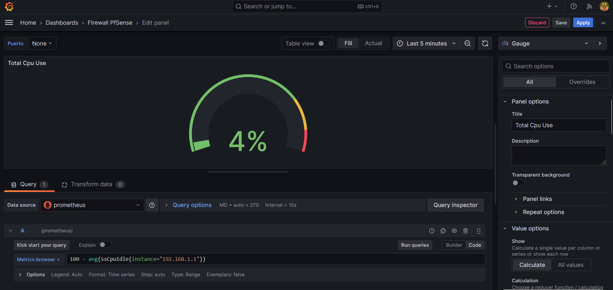

Consulta:`100 - avg(ssCpuIdle{instance="192.168.1.1"})`

- **Explicación:** La métrica `ssCpuIdle` mide el porcentaje de tiempo que la CPU está **ociosa**. Al restarlo de 100, obtienes el porcentaje de **uso real**.

### Tipo de Panel (Visualización)

- En el selector de visualización (arriba a la derecha), elige **Gauge**.

### Configuración del Panel (Right Sidebar)

Ajusta los siguientes parámetros para que luzca idéntico:

- **Panel options:**
    - **Title:** `Total Cpu Use`.
- **Value options:**
    - **Calculation:** `Last *`.
- **Standard options:**
    - **Unit:** Selecciona **Misc / Percent (0-100)**.
    - **Min:** `0`.
    - **Max:** `100`.
- **Thresholds (Umbrales):**
    - Aquí es donde defines los colores del arco:
        - **Verde (base):** Desde 0.
        - **Amarillo:** Por ejemplo, en `70`.
        - **Rojo:** Por ejemplo, en `90`.

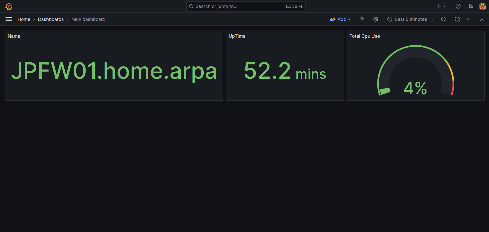

Ahora seguiremos con otro para ver el estado de las interfaces del firewall PfSense, para eso agregamos otra visualización:

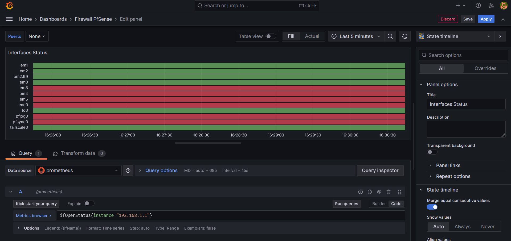

Consulta: `ifOperStatus{instance="192.168.1.1"}`

**Legend:** Cambia el formato de la leyenda a **Custom** y escribe: `{{ifName}}`.

- *Esto es vital para que a la izquierda aparezcan los nombres de las interfaces (em1, em2, tailscale0, etc.) en lugar de una cadena de texto larga.*

### Tipo de Panel (Visualización)

- En el selector de visualización (arriba a la derecha), elige **State timeline**.

**Panel options:**

- **Title:** `Interfaces Status`

**State timeline (opciones específicas):**

- **Merge equal consecutive values:** **Activado** (en azul). Esto hace que se vean barras continuas en lugar de puntitos.
- **Show values:** `Auto`.

**Value mappings (Mapeo de valores):**

- Esta es la parte más importante. La métrica `ifOperStatus` devuelve números (1 para encendido, 2 para apagado). Debes crear dos reglas:
    1. **Value:** `1` -> **Text:** `UP` | **Color:** Verde.
    2. **Value:** `2` -> **Text:** `DOWN` | **Color:** Rojo.


Ahora agregaremos un último panel para ver el total de tráfico entrante y saliente del firewall


Consultas:

- **Consulta A (Entrada): `sum(rate(ifHCInOctets{instance="192.168.1.1"}[$__rate_interval]) * 8)**`
    - **Legend:** `Total Entrada`
- **Consulta B (Salida): `sum(rate(ifHCOutOctets{instance="192.168.1.1"}[$__rate_interval]) * 8)**`
    - **Legend:** `Total Salida`

### Tipo de Panel y Estilo

- **Visualización:** `Time series`.
- **Graph styles (Panel options):**
    - **Style:** `Lines`.
    - **Fill opacity:** `30%` o `40%` (para que se vea el relleno de color bajo la línea).

### Ajustes del Eje y Unidades (Standard options)

- **Unit:** Selecciona **Data rate / bits/sec (SI)**. Grafana entenderá automáticamente cuándo mostrar `kbps`, `Mbps` o `Gbps`.

### Configuración de la Leyenda (Legend)

Para que se vea como una tabla en la parte inferior:

- **Visibility:** `On`.
- **Mode:** `Table`.
- **Placement:** `Bottom`.
- **Values:** Selecciona `Last`, `Min`, `Mean` (promedio) y `Max`.

y en el apartado de override para que se vea invertido el total de salida:


En Fields with name ponemos Total Salida, y en Graph styles → Transform ponemos Negative Y.

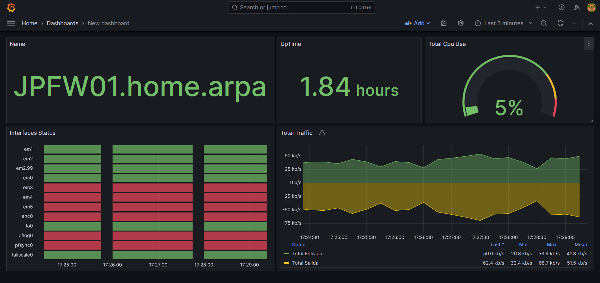

Y finalmente así queda nuestro dashboard para el firewall PfSense utilizando grafana, prometheus y el exportador snmp.