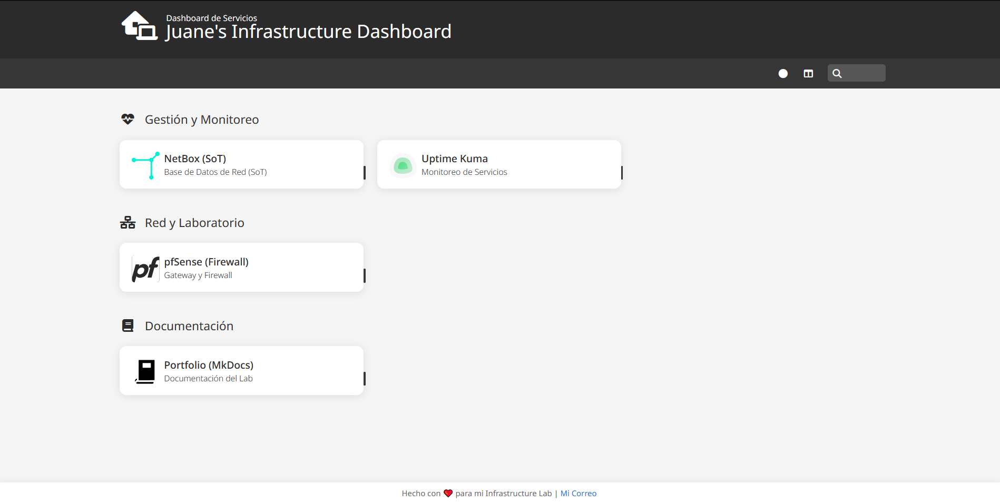

# :doughnut: Homer (Portal de Servicios)

> **URL de Acceso:** `https://homer.js-lab-uy.duckdns.org`

Homer es un dashboard estático y simple, auto-alojado. Es la **"página de inicio"** de todo nuestro laboratorio.

## 1. Propósito

El objetivo de Homer es simple: proporcionar un **punto de acceso único y centralizado** a todas las interfaces web de nuestros servicios.

## 2. Dashboard Principal

El dashboard de Homer está organizado en grupos lógicos (Gestión, Red, etc.) y muestra una tarjeta para cada servicio.




## 3. Configuración

Toda la configuración del dashboard se maneja en un único archivo de texto: `config.yml`.

Este archivo se encuentra en la carpeta de assets (`/opt/homer/assets/`) que se mapea al contenedor. Para añadir un nuevo servicio, simplemente se edita este archivo.

```yaml title="/opt/homer/assets/config.yml (extracto incompleto)"
---

title: "Juane's Infrastructure Dashboard"
subtitle: "Dashboard de Servicios"
icon: "fas fa-house-laptop"

# Columnas de la página de inicio
columns: "3" 

defaults:
  layout: list
  colorTheme: dark

footer: 'Hecho con ❤️ para mi Infrastructure Lab | <a href="juanesiecola@gmail.com" target="_blank">Mi Correo</a>'

theme: default 
services:
  # --- Grupo 1: Gestión y Monitoreo ---
  - name: "Gestión y Monitoreo"
    icon: "fas fa-heartbeat" 
    items:
      # --- NetBox ---
      - name: "NetBox (SoT)"
        logo: "assets/icons/netbox.svg" 
        subtitle: "Base de Datos de Red (SoT)"
        tag: "infra"
        url: "https://netbox.js-lab-uy.ddnsfree.com"

      # --- Uptime Kuma ---
      - name: "Uptime Kuma"
        logo: "assets/icons/uptime-kuma.svg" 
        subtitle: "Monitoreo de Servicios"
        tag: "monitoring"
        url: "https://kuma.js-lab-uy.ddnsfree.com"

  # --- Grupo 2: Red y Laboratorio ---
  - name: "Red y Laboratorio"
    icon: "fas fa-network-wired"
    items:
      # --- pfSense ---
      - name: "pfSense (Firewall)"
        logo: "assets/icons/pfsense-light.svg"
        subtitle: "Gateway y Firewall"
        tag: "network"
        url: "http://100.127.26.75/"
```

## 4. Despliegue (Docker)

```yaml title="docker-compose.yml"
services:
  homer:
    image: b4bz/homer
    container_name: homerDash
    volumes:
      - /opt/homer/assets:/www/assets
    ports:
      - 3000:8080
    user: 1000:1000 # default
    environment:
      - INIT_ASSETS=1
    restart: unless-stopped
```