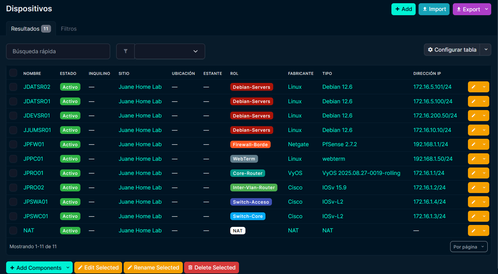
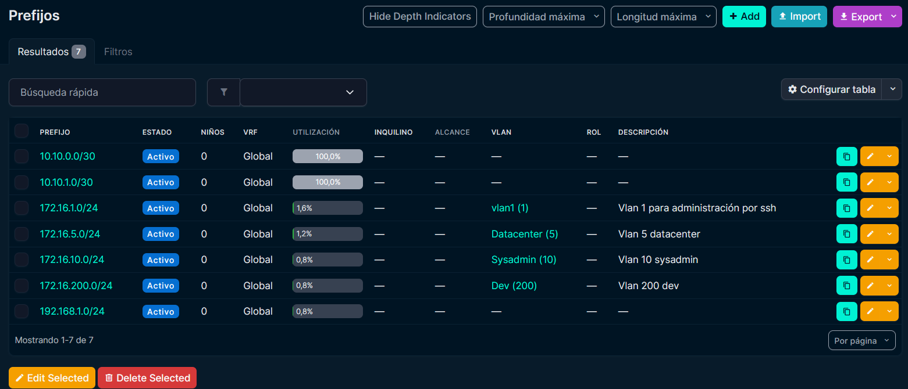

# :material-file-document: NetBox (Source of Truth)

> **URL de Acceso:** `https://netbox.js-lab-uy.duckdns.org`

NetBox es una herramienta de código abierto para la gestión de infraestructura. Es el componente más importante de nuestra gestión: actúa como la fuente de confianza de nuestro laboratorio.

## 1. Propósito

El objetivo de NetBox es reemplazar las hojas de cálculo y la documentación estática.

NetBox es la base de datos central que contiene un registro de cada dispositivo, cable, VLAN y dirección IP que existe en la topología.

## 2. Vistas del Inventario

NetBox proporciona una vista detallada y relacional de todos los componentes de la infraestructura. Las vistas más importantes son el IPAM (gestión de IPs) y el inventario de dispositivos.

### 2.1 Dispositivos


### 2.2 Vlans


### 2.3 Prefijos


### 2.4 Cableado


## 3. Componentes Documentados

La base de datos de NetBox ha sido poblada para reflejar exactamente la topología del laboratorio GNS3:

* **Sitio:** Se creó un sitio (`Juane Home Lab`) para alojar todos los dispositivos.
* **Fabricantes y Modelos:** Se crearon `Device Types` para `Cisco`, `VyOS`, `pfSense`, `Debian`, etc., con sus respectivas interfaces (`GigabitEthernet0/0`, `eth0`, `ens4`).
* **Dispositivos:** Todos los dispositivos de la topología (`JPROO1`, `JPSWA01`, `JDATSR01`, etc.) han sido creados y asignados a sus roles.
* **VLANs y Prefijos:** Todas las VLANs (1, 5, 10, 200) y subredes (Prefixes) están registradas.
* **Cables:** Todas las conexiones físicas (virtuales) entre dispositivos en GNS3 se han replicado como "cables" en NetBox, conectando interfaces específicas.

## 4. Despliegue (Docker)

NetBox se ejecuta como una pila (stack) de contenedores de Docker, gestionada por `docker-compose`. Esta pila incluye la propia aplicación de NetBox, una base de datos PostgreSQL y un caché de Redis. Para su implementación se utilizó un repositorio público de github llamado NetBox-Community [netbox-community](https://github.com/netbox-community/netbox).


```yaml title="docker-compose.yml"
services:
  netbox: &netbox
    image: docker.io/netboxcommunity/netbox:${VERSION-v4.4-3.4.1}
    depends_on:
      - postgres
      - redis
      - redis-cache
    env_file: env/netbox.env
    user: "unit:root"
    healthcheck:
      test: curl -f http://localhost:8080/login/ || exit 1
      start_period: 90s
      timeout: 3s
      interval: 15s
    volumes:
      - ./configuration:/etc/netbox/config:z,ro
      - netbox-media-files:/opt/netbox/netbox/media:rw
      - netbox-reports-files:/opt/netbox/netbox/reports:rw
      - netbox-scripts-files:/opt/netbox/netbox/scripts:rw
  netbox-worker:
    <<: *netbox
    depends_on:
      netbox:
        condition: service_healthy
    command:
      - /opt/netbox/venv/bin/python
      - /opt/netbox/netbox/manage.py
      - rqworker
    healthcheck:
      test: ps -aux | grep -v grep | grep -q rqworker || exit 1
      start_period: 20s
      timeout: 3s
      interval: 15s

  # postgres
  postgres:
    image: docker.io/postgres:17-alpine
    healthcheck:
      test: pg_isready -q -t 2 -d $$POSTGRES_DB -U $$POSTGRES_USER
      start_period: 20s
      timeout: 30s
      interval: 10s
      retries: 5
    env_file: env/postgres.env
    volumes:
      - netbox-postgres-data:/var/lib/postgresql/data

  # redis
  redis:
    image: docker.io/valkey/valkey:8.1-alpine
    command:
      - sh
      - -c # this is to evaluate the $REDIS_PASSWORD from the env
      - valkey-server --appendonly yes --requirepass $$REDIS_PASSWORD ## $$ because of docker-compose
    healthcheck: &redis-healthcheck
      test: '[ $$(valkey-cli --pass "$${REDIS_PASSWORD}" ping) = ''PONG'' ]'
      start_period: 5s
      timeout: 3s
      interval: 1s
      retries: 5
    env_file: env/redis.env
    volumes:
      - netbox-redis-data:/data
  redis-cache:
    image: docker.io/valkey/valkey:8.1-alpine
    command:
      - sh
      - -c # this is to evaluate the $REDIS_PASSWORD from the env
      - valkey-server --requirepass $$REDIS_PASSWORD ## $$ because of docker-compose
    healthcheck: *redis-healthcheck
    env_file: env/redis-cache.env
    volumes:
      - netbox-redis-cache-data:/data

volumes:
  netbox-media-files:
    driver: local
  netbox-postgres-data:
    driver: local
  netbox-redis-cache-data:
    driver: local
  netbox-redis-data:
    driver: local
  netbox-reports-files:
    driver: local
  netbox-scripts-files:
    driver: local
```