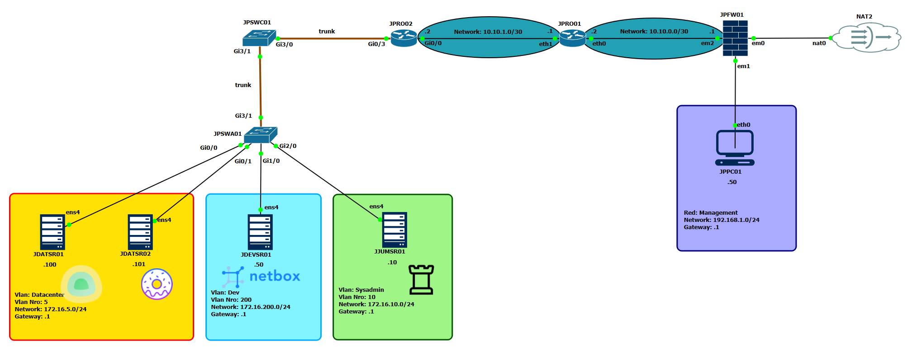

# Diagrama General de la Topología 

A continuación se muestra la topología simulada en **GNS3**, conectada mediante **Tailscale** a una
vm de Azure.  
Incluye routers Cisco y VyOS, switches Cisco, un firewall pfSense y servidores debian 12.
También se muestra con un icono el servicio de docker desplegado en cada server.

